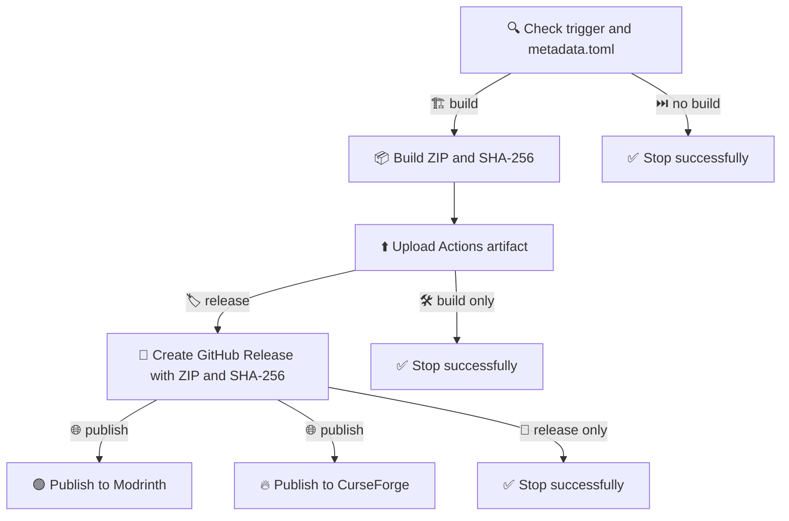

# 🏗️ Build, Release, and Publish Workflow 🚀

> **[📖 English](build.md)**
> **[📖 简体中文](build.zh-cn.md)**

## 👀 Overview

This workflow builds the WireSight shaderpack, creates GitHub Releases, and can publish the same ZIP to Modrinth and CurseForge. Push triggers inspect only the first line of the commit message and require an exact, case-insensitive suffix.

| 📝 Commit subject suffix | 📦 Actions artifact | 🏷️ GitHub Release | 🟢 Modrinth | 🔥 CurseForge |
|---|:---:|:---:|:---:|:---:|
| 🛠️ `(build action)` | ✅ | ❌ | ❌ | ❌ |
| 🏷️ `(build release)` | ✅ | ✅ | ❌ | ❌ |
| 🚀 `(build publish)` | ✅ | ✅ | ✅ | ✅ |

Pull requests always build without releasing. A push without one of these suffixes only runs the check job. The same three modes are available through `workflow_dispatch`; a matching `v*` tag creates a GitHub Release but does not publish to external platforms.

## 🧩 Repository Metadata

No Repository variables are required. Public publishing settings live in `metadata.toml`:

- 🟢 `modrinth.project = "wiresight"` selects the Modrinth project.
- 🥽 `modrinth.loaders = ["iris", "optifine"]` tags the supported shader loaders.
- 🔥 `curseforge.project = 1623760` selects the CurseForge project.
- 🎮 `minecraft.versions` contains all 19 supported stable Minecraft versions.

`(build publish)` validates this metadata and both Secrets before building or creating a GitHub Release. The public configuration remains reviewable in Git history.

## 🔄 Pipeline

```text
📝 commit / manual dispatch / pull request
                    |
                    v
       🔍 check trigger and metadata.toml
                    |
        +-----------+-----------+
        |                       |
⏭️ no build requested   🏗️ build shaderpack
    ✅ stop green       📦 ZIP + SHA-256 artifact
                                |
                      🏷️ release requested?
                          |             |
                         no            yes
                     ✅ stop    🚀 GitHub Release
                            📄 ZIP + SHA-256 + notes
                                         |
                              🌐 publish requested?
                                   |             |
                                  no            yes
                              ✅ stop      +----+----+
                                            |         |
                                    🟢 Modrinth  🔥 CurseForge
                                  Iris + OptiFine    Shader
```



The Modrinth and CurseForge jobs run independently after the GitHub Release succeeds. One platform failing does not cancel or hide the result of the other platform job.

## 🏷️ Version and Release Notes

`metadata.toml` is the single source of truth for the artifact name, release tag, platform version number, supported Minecraft versions, loaders, and public project IDs. Before `(build release)` or `(build publish)`, change `[project].version` to a version that does not already have a GitHub Release.

| 🔢 `metadata.toml` version | 🚦 Platform release type | 🧪 GitHub prerelease |
|---|---|---|
| `0.3.0` | 🚀 `release` | ❌ |
| `0.3.0-beta.1` | 🧪 `beta` | ✅ |
| `0.3.0-alpha.1` | 🧪 `alpha` | ✅ |

The Actions artifact and GitHub Release contain `WireSight-X.Y.Z.zip` and its `.zip.sha256` file. Modrinth and CurseForge receive only the ZIP.

Release notes are rendered from `.github/release_template.md`. They contain the version, branch or tag, commit hash, commit time, commits since the previous tag, and a full changelog link. Existing Releases, including `v0.2.0`, are not rewritten.

## 🟢 Create a Modrinth Project

1. 🔑 Sign in to [Modrinth](https://modrinth.com) and open [Create a project](https://modrinth.com/create/project).
2. 📝 Select the `Shader` project type, enter the WireSight name, summary, description, MIT license, source URL, and issue tracker URL.
3. 🎮 Select Iris and OptiFine as the supported loaders and select the 19 stable Minecraft versions listed below.
4. 🥽 State in the description that the pack also supports Oculus through the shared OptiFine ShaderPack format; Modrinth does not currently provide an Oculus loader tag.
5. ✅ Submit the project for review. WireSight uses the `wiresight` slug stored in `metadata.toml`.
6. 🔐 Open [Modrinth API tokens](https://modrinth.com/settings/pats), create a token with permission to create versions, and copy it immediately.

⚠️ Do not run `(build publish)` until the project is accepted and `MODRINTH_TOKEN` is configured. A validator `404` remains a warning and falls back to the `wiresight` slug.

## 🔥 Create a CurseForge Project

1. 🔑 Sign in to [CurseForge for Authors](https://authors.curseforge.com) and create a Minecraft project in the `Shaders` category.
2. 📝 Enter the WireSight name, summary, description, MIT license, source URL, supported game versions, and a clear Iris/Oculus/OptiFine compatibility note.
3. ⬆️ Upload the initial file if the project form requires one, then submit the project for moderation.
4. 🆔 After the project exists, verify that its numeric Project ID is `1623760`, as stored in `metadata.toml`.
5. 🔐 Open the [CurseForge API Tokens](https://authors.curseforge.com/#/settings/api-tokens) page, generate an upload token, and copy it immediately.
6. 🔢 Run `uv run python ./scripts/validate_publish.py` and enter both API tokens when prompted. The read-only validator checks every CurseForge version and version type without uploading a file.

The workflow sends namespaced values such as `Minecraft 1.20:1.20.1`; the CurseForge Action resolves the corresponding numeric IDs at publish time.

## ⚙️ Configure GitHub Actions

In the GitHub repository, open `Settings` > `Secrets and variables` > `Actions`.

### 🔐 Repository secrets

Open the `Secrets` tab and add these repository secrets:

| 🔑 Name | 🧾 Value | 🎯 Purpose |
|---|---|---|
| 🟢 `MODRINTH_TOKEN` | Modrinth personal access token | Authenticate Modrinth uploads |
| 🔥 `CURSEFORGE_TOKEN` | CurseForge author API token | Authenticate CurseForge uploads |

## 🧱 Supported Minecraft Versions

Both platform uploads target these 19 stable releases and exclude snapshots, pre-releases, and release candidates:

```text
1.20, 1.20.1, 1.20.2, 1.20.3, 1.20.4, 1.20.5, 1.20.6,
1.21, 1.21.1, 1.21.2, 1.21.3, 1.21.4, 1.21.5, 1.21.6,
1.21.7, 1.21.8, 1.21.9, 1.21.10, 1.21.11
```

Modrinth receives these names directly and uses the `iris` and `optifine` loader tags. CurseForge receives namespaced values from `metadata.toml` and resolves numeric IDs through its API.

## ⌨️ Usage

```bash
# 🐍 Create the Python 3.13 environment and run local checks.
uv venv
uv run python ./scripts/build_shaderpack.py
uv run python ./scripts/validate_publish.py

# 🛠️ Build and upload an Actions artifact only.
git commit --allow-empty -m "ci: verify package (build action)"

# 🏷️ Build and create a GitHub Release only.
git commit -m "release: publish WireSight vX.Y.Z (build release)"

# 🚀 Run the complete GitHub, Modrinth, and CurseForge pipeline.
git commit -m "release: publish WireSight vX.Y.Z (build publish)"
```

📌 Always update `[project].version` in `metadata.toml` and commit the intended code and documentation before using a release or publish suffix. 🔒 Never place tokens in metadata, the workflow file, commit message, Actions log, or release notes.
