# 🏗️ 构建、发布与平台上架工作流 🚀

> **[📖 English](build.md)**
> **[📖 简体中文](build.zh-cn.md)**

## 👀 概述

此工作流用于构建 WireSight 光影包、创建 GitHub Release，并可将同一个 ZIP 发布到 Modrinth 与 CurseForge。推送触发时只检查提交信息的第一行，并要求标题以指定标记准确结尾，匹配时不区分大小写。

| 📝 提交标题后缀 | 📦 Actions 构建产物 | 🏷️ GitHub Release | 🟢 Modrinth | 🔥 CurseForge |
|---|:---:|:---:|:---:|:---:|
| 🛠️ `(build action)` | ✅ | ❌ | ❌ | ❌ |
| 🏷️ `(build release)` | ✅ | ✅ | ❌ | ❌ |
| 🚀 `(build publish)` | ✅ | ✅ | ✅ | ✅ |

Pull Request 始终只构建而不发布。没有这些后缀的推送只会运行检查 job。`workflow_dispatch` 也提供相同的三种模式；推送匹配的 `v*` 标签会创建 GitHub Release，但不会发布到外部平台。

## 🧩 仓库元数据

无需配置 Repository Variables。公开发布设置统一保存在 `metadata.toml` 中：

- 🟢 `modrinth.project = "SChVy308"` 用于选择 Modrinth 内部 Project ID。
- 🥽 `modrinth.loaders = ["iris", "optifine"]` 用于标记支持的光影加载器。
- 🔥 `curseforge.project = 1623760` 用于选择 CurseForge 项目。
- 🎮 `minecraft.versions` 包含全部 19 个受支持的 Minecraft 正式版本。

`(build publish)` 会在构建或创建 GitHub Release 前验证这些元数据与两个 Secrets。公开配置会保留在可审查的 Git 历史中。

## 🔄 流水线

```text
📝 提交 / 手动启动 / Pull Request
                    |
                    v
        🔍 检查触发条件与 metadata.toml
                    |
        +-----------+-----------+
        |                       |
  ⏭️ 未要求构建          🏗️ 构建光影包
    ✅ 正常结束       📦 ZIP + SHA-256 构建产物
                                |
                       🏷️ 是否要求 Release?
                          |             |
                         否             是
                   ✅ 正常结束   🚀 GitHub Release
                         📄 ZIP + SHA-256 + 发布说明
                                         |
                         🌐 是否要求发布到平台?
                                   |             |
                                  否             是
                           ✅ 正常结束     +----+----+
                                            |         |
                                    🟢 Modrinth  🔥 CurseForge
                                  Iris + OptiFine    Shader
```



```mermaid
flowchart TB
    C[🔍 检查触发条件与 metadata.toml] -->|🏗️ 构建| B[📦 构建 ZIP 与 SHA-256]
    C -->|⏭️ 不构建| S1[✅ 正常结束]
    B --> A[⬆️ 上传 Actions 构建产物]
    A -->|🏷️ Release| R[🚀 创建含 ZIP 与 SHA-256 的 GitHub Release]
    A -->|🛠️ 仅构建| S2[✅ 正常结束]
    R -->|🌐 平台发布| M[🟢 发布到 Modrinth]
    R -->|🌐 平台发布| F[🔥 发布到 CurseForge]
    R -->|🏁 仅 Release| S3[✅ 正常结束]
```

GitHub Release 成功后，Modrinth 与 CurseForge job 会相互独立地运行。一个平台失败不会取消或遮盖另一个平台 job 的结果。

## 🏷️ 版本与发布说明

`metadata.toml` 是构建产物名称、Release 标签、平台版本号、支持的 Minecraft 版本、加载器与公开项目 ID 的唯一来源。使用 `(build release)` 或 `(build publish)` 前，应将 `[project].version` 改为尚不存在对应 GitHub Release 的版本。

| 🔢 `metadata.toml` 版本 | 🚦 平台发布类型 | 🧪 GitHub 预发布 |
|---|---|---|
| `0.3.0` | 🚀 `release` | ❌ |
| `0.3.0-beta.1` | 🧪 `beta` | ✅ |
| `0.3.0-alpha.1` | 🧪 `alpha` | ✅ |

Actions 构建产物与 GitHub Release 均包含 `WireSight-X.Y.Z.zip` 及其 `.zip.sha256` 文件。Modrinth 和 CurseForge 只接收 ZIP。

发布说明从 `.github/release_template.md` 渲染，包含版本、分支或标签、提交哈希、提交时间、上一个标签以来的提交记录和完整变更链接。现有 Release（包括 `v0.2.0`）不会被重写。

## 🟢 创建 Modrinth 项目

1. 🔑 登录 [Modrinth](https://modrinth.com)，打开[创建项目](https://modrinth.com/create/project)页面。
2. 📝 项目类型选择 `Shader`，填写 WireSight 名称、摘要、说明、MIT 许可证、源代码地址和问题反馈地址。
3. 🎮 支持的加载器选择 Iris 与 OptiFine，并选择下文列出的 19 个 Minecraft 正式版本。
4. 🥽 在说明中注明本光影通过通用 OptiFine ShaderPack 格式兼容 Oculus；Modrinth 目前没有独立的 Oculus loader 标签。
5. ✅ 确认 `wiresight` 项目的内部 ID 为 `SChVy308`，并与 `metadata.toml` 保持一致。
6. 🔐 打开 [Modrinth API Tokens](https://modrinth.com/settings/pats)，创建具有新建版本权限的 Token，并立即复制保存。

`MODRINTH_TOKEN` 只需勾选以下两个作用域：

- 👀 项目 → 读取项目（`PROJECT_READ`），供 `validate_publish.py` 查询并确认 WireSight 项目。
- ⬆️ 版本 → 创建版本（`VERSION_CREATE`），供 GitHub Actions 上传文件并创建 Modrinth 版本。

⚠️ `(build publish)` 要求 `MODRINTH_TOKEN` 能读取 Project ID `SChVy308`；遇到 `404` 会直接失败且不会回退使用 slug。
🧪 无版本的 `project + draft` 占位状态仅允许首次上传；存在任何版本后，API 必须返回 `project_type = shader`。

## 🔥 创建 CurseForge 项目

1. 🔑 登录 [CurseForge for Authors](https://authors.curseforge.com)，在 Minecraft 的 `Shaders` 分类中创建项目。
2. 📝 填写 WireSight 名称、摘要、说明、MIT 许可证、源代码地址、支持的游戏版本以及清晰的 Iris/Oculus/OptiFine 兼容性说明。
3. ⬆️ 如果项目表单要求初始文件，则先上传文件，再提交项目审核。
4. 🆔 项目建立后，确认其数字 Project ID 为 `1623760`，并与 `metadata.toml` 保持一致。
5. 🔐 打开 [CurseForge API Tokens](https://authors.curseforge.com/#/settings/api-tokens) 页面，生成上传 Token，并立即复制保存。
6. 🔢 运行 `uv run python ./scripts/validate_publish.py`，按提示输入两个 API Token。只读验证器会检查全部 CurseForge 版本与版本类型，不会上传文件。

工作流会发送 `Minecraft 1.20:1.20.1` 这样的命名空间值；CurseForge Action 会在发布时解析对应的数字 ID。

## ⚙️ 配置 GitHub Actions

在 GitHub 仓库中打开 `Settings` > `Secrets and variables` > `Actions`。

### 🔐 仓库 Secrets

打开 `Secrets` 标签页并添加以下 Repository secrets：

| 🔑 名称 | 🧾 值 | 🎯 用途 |
|---|---|---|
| 🟢 `MODRINTH_TOKEN` | Modrinth Personal Access Token | 认证 Modrinth 上传 |
| 🔥 `CURSEFORGE_TOKEN` | CurseForge 作者 API Token | 认证 CurseForge 上传 |

## 🧱 支持的 Minecraft 版本

两个平台均面向以下 19 个正式版本，不包含 snapshot、pre-release 或 release candidate：

```text
1.20, 1.20.1, 1.20.2, 1.20.3, 1.20.4, 1.20.5, 1.20.6,
1.21, 1.21.1, 1.21.2, 1.21.3, 1.21.4, 1.21.5, 1.21.6,
1.21.7, 1.21.8, 1.21.9, 1.21.10, 1.21.11
```

Modrinth 直接接收这些版本名称，并使用 `iris` 与 `optifine` loader 标签。CurseForge 从 `metadata.toml` 接收命名空间值，并通过其 API 解析数字 ID。

## ⌨️ 用法

```bash
# 🐍 创建 Python 3.13 环境并运行本地检查。
uv venv
uv run python ./scripts/build_shaderpack.py
uv run python ./scripts/validate_publish.py

# 🛠️ 仅构建并上传 Actions 构建产物。
git commit --allow-empty -m "ci: verify package (build action)"

# 🏷️ 仅构建并创建 GitHub Release。
git commit -m "release: publish WireSight vX.Y.Z (build release)"

# 🚀 执行 GitHub、Modrinth 与 CurseForge 完整发布流程。
git commit -m "release: publish WireSight vX.Y.Z (build publish)"
```

📌 使用 release 或 publish 后缀前，务必先更新 `[project].version`（位于 `metadata.toml`），并提交计划发布的代码与文档。🔒 不要把 Token 写入元数据、工作流文件、提交信息、Actions 日志或发布说明。
