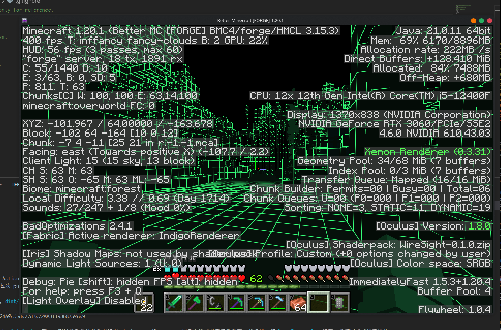

# WireSight

WireSight is an experimental, low-overhead Minecraft Java shaderpack that renders
the world like a solid modeling view: dark green faces with bright green block
edges.

The pack targets the OptiFine shaderpack format shared by Iris, Oculus, and
OptiFine. Its core path uses GLSL 1.20, a single terrain pass, normal depth
writes, and no shadows or full-screen post-processing.

## Preview



## Current scope

- Visible 1x1 block boundaries on terrain and block entities
- Three flat face shades for spatial readability
- Pixel-stable, antialiased green edges
- Automatic distant-grid filtering to reduce shimmer
- Alpha preservation for cutout geometry such as leaves and plants
- Flat-color entities, particles, weather, and held items
- Original colors and transparency for name tags and world-space text
- Opaque stylized water and a black sky

Only visible geometry can be outlined. WireSight is not an X-ray shader and does
not render faces that Minecraft removes from chunk meshes.

## Compatibility target

- Minecraft Java Edition shaderpack loaders
- Iris
- Oculus
- OptiFine

The first tested target is Minecraft 1.20.1 with Oculus 1.8.0 and Embeddium
0.3.31. The shader intentionally avoids compute shaders, geometry shaders, and
loader-specific extensions.

## Install

Place the release zip in the Minecraft instance's `shaderpacks` directory, then
select WireSight from the shader pack menu.

## Build and release

Build locally with 7-Zip:

```bash
./scripts/build.sh
./scripts/build.sh X.Y.Z
```

Archives and SHA-256 checksum files are written to `dist/`. The version defaults
to the value in `VERSION`.

GitHub Actions observes these commit-message markers on pushes:

- `build action`: build and upload a workflow artifact
- `build release`: build and publish the version in `VERSION` from `main` or
  `master`

Pull requests are always built. Builds and releases can also be started
manually, and pushing a `v*` tag publishes the matching release version.

```bash
# Build and upload an Actions artifact without creating a Release.
git commit --allow-empty -m "ci: test WireSight package (build action)"

# Build and publish the version declared in VERSION.
git commit -m "release: vX.Y.Z summary (build release)"
```
