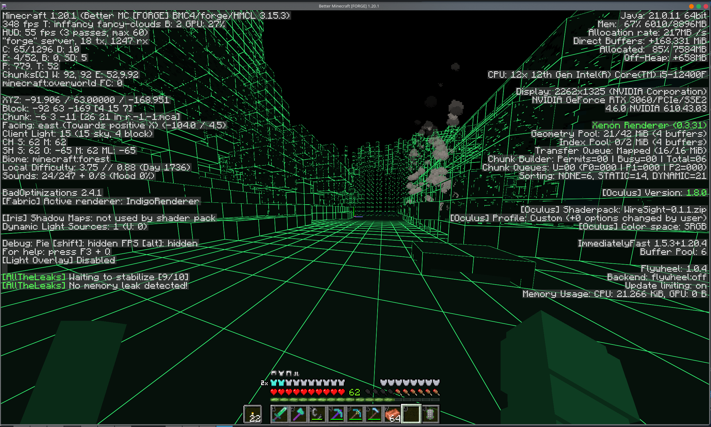

> **[📖 English](README.md)**
> **[📖 简体中文(大陆)](README.zh-cn.md)**


# 🟢 WireSight

🧱 WireSight is an experimental, low-overhead Minecraft Java shaderpack that renders the world like a solid modeling view: dark green faces with bright green block edges.

⚙️ The pack targets the OptiFine shaderpack format shared by Iris, Oculus, and OptiFine. Its core path uses GLSL 1.20, a single terrain pass, normal depth writes, and no shadows or full-screen post-processing.

[](https://modrinth.com/shader/wiresight)
[](https://www.curseforge.com/minecraft/shaders/wiresight)

[](https://qm.qq.com/q/4vjto4V7Di)

<p><del>💬 Shaderpack usage / 🐛 Bug reports / 👨‍💻 Development discussion — Join our QQ Group: <b>259248174</b> 🎉 (This group is gone)</del></p>
<p>💬 Shaderpack usage / 🐛 Bug reports / 👨‍💻 Development discussion — Join our QQ Group: <b>1085190201</b> 🎉</p>
<p>💡 Mention me in the group for faster replies ~ ✨</p>

---

## 🖼️ Preview



## 🎨 Default theme colors

🎯 WireSight uses the following base colors by default (RGB and hex denote the same color):

| 🎯 Render target | RGB | Hex | Appearance |
|---|---|---|---|
| 🧱 Regular block faces | `RGB(6, 17, 11)` | `#06110B` | Dark green |
| 🌊 Water and translucent terrain | `RGB(5, 21, 19)` | `#051513` | Dark cyan-green |
| ✨ Block edges | `RGB(53, 255, 120)` | `#35FF78` | Fluorescent green |
| 👤 Entities, held items, particles, and weather | `RGB(14, 61, 34)` | `#0E3D22` | Flat green |
| 🌌 Sky, sun, moon, and clouds | `RGB(0, 0, 0)` | `#000000` | Black |

💡 These values are base colors; directional face shading further darkens terrain and entity sides and undersides.

## 🎛️ Shader settings

⚙️ WireSight uses the common OptiFine ShaderPack option format supported by Iris, Oculus, and OptiFine. The loader skin may differ, but the controls and order remain the same.

### 🧭 Main screen

```text
+--------------------------------+--------------------------------+
| Theme Preset: WireSight Green  | Custom Theme Colors...         |
| Directional Face Shading: On   | Edge Width: 1.5                |
| Edge Fade Start: 96 blocks     | Edge Fade Length: 64 blocks    |
+--------------------------------+--------------------------------+
```

- 🌓 `Directional Face Shading` uses fixed brightness levels for top, side, and underside faces; it is not dynamic lighting.
- 📏 `Edge Width` controls the approximate on-screen pixel width of block edges.
- 🌫️ `Edge Fade Start` is the distance where edges begin fading.
- 📐 `Edge Fade Length` is the distance used to complete that fade, so the defaults end at `96 + 64 = 160` blocks.

### 🌈 Custom theme colors

```text
+----------------------+----------------------+----------------------+
| Theme Preset: Custom                                               |
+----------------------+----------------------+----------------------+
| Block Face R: 6      | Block Face G: 17     | Block Face B: 11     |
| Water R: 5           | Water G: 21          | Water B: 19          |
| Block Edge R: 53     | Block Edge G: 255    | Block Edge B: 120    |
| Entity R: 14         | Entity G: 61         | Entity B: 34         |
| Sky R: 0             | Sky G: 0             | Sky B: 0             |
+----------------------+----------------------+----------------------+
```

> **⚠️ Important:** Custom RGB values are applied only when `Theme Preset` is set to `Custom`.

🔢 Each channel has full integer precision from `0` to `255`. Custom values remain saved when another preset is selected and return unchanged when switching back to `Custom`.

### 🧩 Built-in presets

| 🎨 Surface | WireSight Green | Cyan | Amber | Monochrome |
|---|---|---|---|---|
| 🧱 Block faces | `#06110B` | `#061116` | `#171006` | `#111111` |
| 🌊 Water | `#051513` | `#051522` | `#071417` | `#151515` |
| ✨ Block edges | `#35FF78` | `#35E7FF` | `#FFC247` | `#F2F2F2` |
| 👤 Entities | `#0E3D22` | `#0E3540` | `#5E3D10` | `#3D3D3D` |
| 🌌 Sky and celestials | `#000000` | `#000000` | `#000000` | `#000000` |

🟠 The Amber preset intentionally keeps water cool and dark to distinguish it from warm terrain. Changing an option may briefly recompile the shader.

## 🔍 Current scope

- 🧱 Visible 1x1 block boundaries on terrain and block entities
- 🌓 Three flat face shades for spatial readability
- ✨ Pixel-stable, antialiased theme-colored edges
- 🌫️ Automatic distant-grid filtering to reduce shimmer
- 🍃 Alpha preservation for cutout geometry such as leaves and plants
- 👤 Flat-color entities, particles, weather, and held items
- 🏷️ Original colors and transparency for name tags and world-space text
- 🌊 Opaque stylized water and a configurable sky

⚠️ Only visible geometry can be outlined. WireSight is not an X-ray shader and does not render faces that Minecraft removes from chunk meshes.

## 🧪 Compatibility target

> 🧪 This shaderpack intentionally avoids compute shaders, geometry shaders, and loader-specific extensions.
>
> | 🔌 Environment | Minecraft | Shader loader | Companion component |
> |---|:---:|---|---|
> | 🥽 Oculus | `1.20.1` | `Oculus 1.8.0` | `Embeddium 0.3.31` |
> | 🌈 Iris | `1.21.8` | `Iris 1.9.1` | `Sodium 0.6.31` |
> | 🔭 OptiFine | `1.8.9` | `OptiFine HD U M5` | `Forge 11.15.1.2318` |

📚 Both builds target every stable Minecraft release from 1.8 through 1.21.x. Unlisted combinations rely on compatible interfaces and have not been tested individually.

## 📦 Install

📥 Place the release zip in the Minecraft instance's `shaderpacks` directory, then select WireSight from the shader pack menu.

## 💻 VS Code

🧩 Install [Shader languages support for VS Code](https://marketplace.visualstudio.com/items?itemName=slevesque.shader) for GLSL syntax highlighting. The tracked `.vscode/settings.json` maps `.glsl`, `.fsh`, and `.vsh` files to GLSL, while `.vscode/extensions.json` recommends the extension automatically.

```bash
code --install-extension slevesque.shader
```

## 🚀 Build, release, and publish

🐍 Build locally with [uv](https://docs.astral.sh/uv/) and Python 3.13:

```bash
uv venv
uv run python ./scripts/build_shaderpack.py
uv run python ./scripts/validate_publish.py
```

📦 Two reproducible ZIPs and their matching SHA-256 files are written to `dist/`. `metadata.toml` is the single source of truth for the WireSight version, variant support ranges, platform project IDs, and loaders.

| 📦 Variant | Artifact | Modrinth loader | Minecraft range |
|---|---|:---:|---|
| 🌈 Iris / Oculus | `WireSight-X.Y.Z-iris-oculus.zip` | `iris` | `1.8` through `1.21.x` |
| 🔭 OptiFine | `WireSight-X.Y.Z-optifine.zip` | `optifine` | `1.8` through `1.21.x` |

⚙️ GitHub Actions observes these exact commit-subject suffixes on pushes:

| 🎯 Mode | Commit subject suffix | Actions artifact | GitHub Release | Modrinth / CurseForge |
|---|---|:---:|:---:|:---:|
| 🛠️ Build | `(build action)` | ✅ | ❌ | ❌ |
| 🏷️ Release | `(build release)` | ✅ | ✅ | ❌ |
| 🚀 Publish | `(build publish)` | ✅ | ✅ | ✅ |

📝 Only the subject line is inspected; matching text in the commit body is ignored.

🔁 Pull requests are always built. Builds, releases, and platform publishing can also be started manually; pushing a `v*` tag creates only the matching GitHub Release.

📖 See the [build, release, and publish guide](.github/workflows/build.md) for the pipeline diagrams, platform project setup, required GitHub Secrets, release metadata, supported Minecraft versions, and release-note format.

```bash
# 🛠️ Build and upload an Actions artifact without creating a Release.
git commit --allow-empty -m "ci: test WireSight package (build action)"

# 🏷️ Build and publish the version declared in metadata.toml.
git commit -m "release: vX.Y.Z summary (build release)"

# 🚀 Build, create a GitHub Release, and publish to Modrinth and CurseForge.
git commit -m "release: vX.Y.Z summary (build publish)"
```
